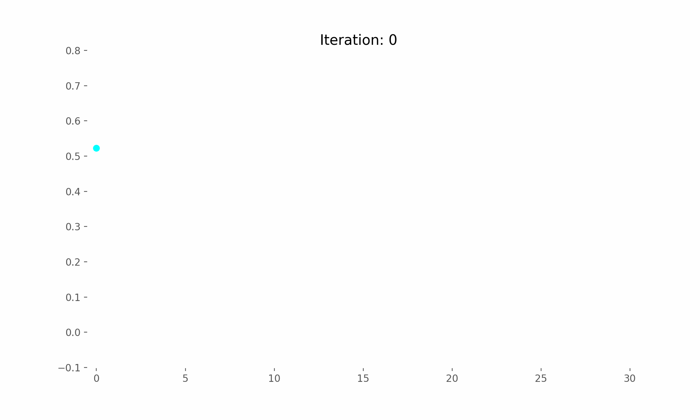
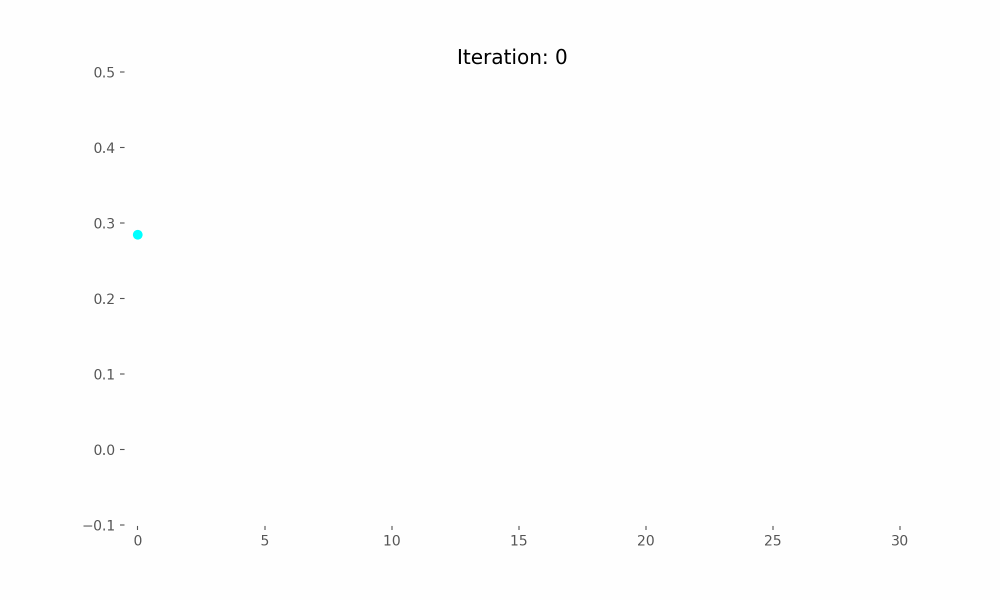
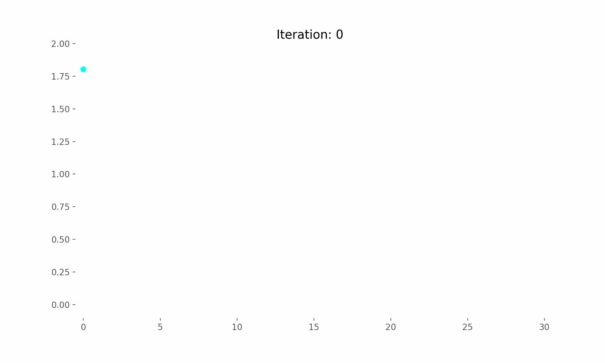
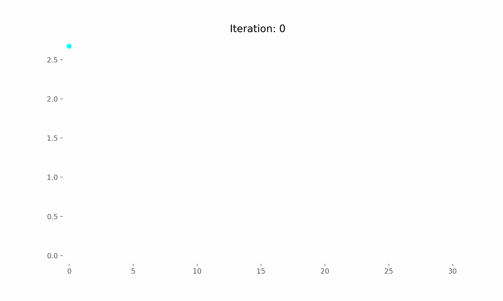
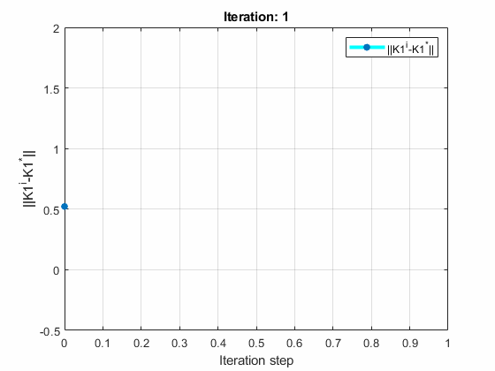
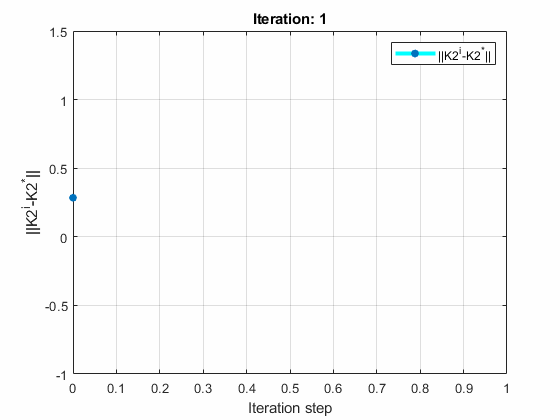
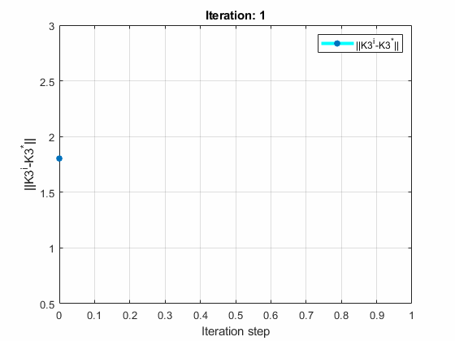
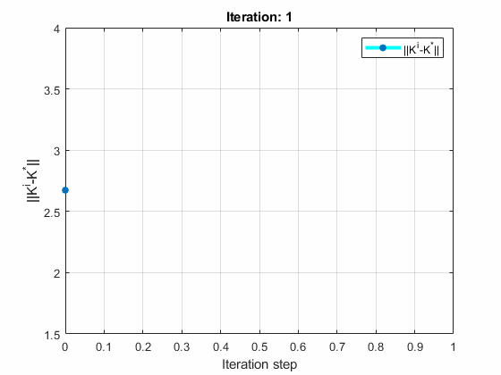

# Intelligent Control for Discrete-Time Multi-Player Systems

## Introduction
This is my simulation for the On-Policy and Off-Policy Algorithm described in **H_{\infty} Control for Discrete-Time Multi-Player
Systems via Off-Policy Q-Learning** [paper](https://www.researchgate.net/publication/338963169_H_Control_for_Discrete-Time_Multi-Player_Systems_via_Off-Policy_Q-Learning).

## Experiments:
The corresponding feedback Nash equilibrium
```math
K_1^* =    \begin{bmatrix}
0.5665 & 0.7300 & 0.1098
    \end{bmatrix}
;
K_2^* =    \begin{bmatrix}
 0.4271 & 0.2752 & 0.0009
    \end{bmatrix}

```
```math
K_3^* =    \begin{bmatrix}
-2.2643 & -2.8476 & 0.0329
    \end{bmatrix}
;
K^* =    \begin{bmatrix}
 -2.2925 & -2.6572 & -0.0032
    \end{bmatrix}

```
Using the On-Policy algorithm, I found the following control matrices
```math
K_1^{\infty} =    \begin{bmatrix}
0.5682  &  0.7309  &  0.1098
    \end{bmatrix}
;
K_2^{\infty} =    \begin{bmatrix}
 0.4281  &  0.2760  &  0.0009
    \end{bmatrix}

```
```math
K_3^{\infty} =    \begin{bmatrix}
-2.2708  & -2.8513  &  0.0329
    \end{bmatrix}
;
K^{\infty} =    \begin{bmatrix}
 -2.2989  & -2.6609 &  -0.0032
    \end{bmatrix}

```

Using the Off-Policy algorithm, I found the following control matrices
```math
K_1^{\infty} =    \begin{bmatrix}
0.5682  &  0.7309  &  0.1098
    \end{bmatrix}
;
K_2^{\infty} =    \begin{bmatrix}
 0.4281  &  0.2760  &  0.0009
    \end{bmatrix}

```
```math
K_3^{\infty} =    \begin{bmatrix}
-2.2708  & -2.8513  &  0.0329
    \end{bmatrix}
;
K^{\infty} =    \begin{bmatrix}
 -2.2989  & -2.6609 &  -0.0032
    \end{bmatrix}

```

## Comment
The probing noise will not affect the
system and the Nash equilibrium solution learned without
deviation with Off-Policy Algorithm.


## Results
### Results On-Policy Algorithm

| Convergence of the optimal control matrix (On-Policy) | Convergence of the optimal control matrix (On-Policy) |
| ------------- | ------------- |
|  |  |

| Convergence of the optimal control matrix (On-Policy) | Convergence of the worst disturbance matrix (On-Policy) |
| ------------- | ------------- |
|  |  |

### Results Off-Policy Algorithm

| Convergence of the optimal control matrix (Off-Policy) | Convergence of the optimal control matrix (Off-Policy) |
| ------------- | ------------- |
|  |  |

| Convergence of the optimal control matrix (Off-Policy) | Convergence of the worst disturbance matrix (Off-Policy) |
| ------------- | ------------- |
|  |  |

## How to use my code

With my code, you can:

* **On-Policy Algorithm** by running `OnPolicySolution.py`
* **Off-Policy Algorithm** by running `OffPolicySolution.m`
* **Off-Policy Algorithm Result Animation** by running `Animation.m`

## Docker
I will provide DockerFile soon.

## Requirements

* **Matlab**
* **python 3.11**
* **numpy**
* **matplotlib**

